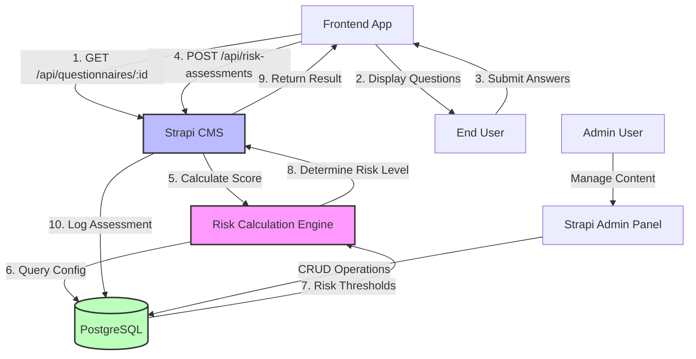
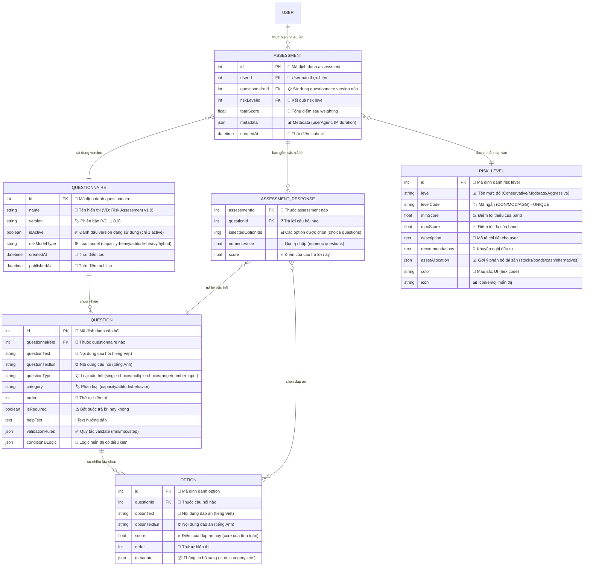

# System Design & Architecture - Risk Assessment Questionnaire

## Architecture Overview
**What is the high-level system structure?**



### Key Components
1. **Strapi CMS**: Headless CMS for content management and API exposure
2. **Risk Calculation Engine**: Custom service/controller xử lý logic tính toán
3. **PostgreSQL Database**: Lưu trữ questionnaire config, user responses, và assessment results
4. **Frontend Application**: React/Next.js app consume APIs
5. **Admin Panel**: Strapi's built-in admin UI cho content management

### Technology Stack
- **Backend Framework**: Strapi v5.x (Node.js + TypeScript)
- **Database**: PostgreSQL 15+ (với JSONB support cho flexible schema)
- **API Style**: RESTful (default Strapi)
- **Validation**: Joi hoặc Yup schemas
- **Authentication**: Strapi's built-in JWT auth
- **Deployment**: Docker + Docker Compose

**Rationale**:
- Strapi: Giảm development time với auto-generated APIs, built-in admin panel
- PostgreSQL: ACID compliance, JSONB cho flexible response storage
- REST: Simple integration, wide client support

## Data Models
**What data do we need to manage?**

### Core Entities

#### 1. Questionnaire (Collection Type)
**Vai trò**: Đại diện cho một bộ khảo sát đánh giá rủi ro hoàn chỉnh. Mỗi questionnaire là một version độc lập có thể được active/inactive.

```typescript
interface Questionnaire {
  // === IDENTIFICATION FIELDS ===
  id: number; 
  // Primary key, auto-generated
  // Mục đích: Định danh duy nhất cho mỗi questionnaire
  
  name: string; 
  // Tên hiển thị của bộ khảo sát
  // VD: "WealthHup Risk Assessment v1.0"
  // Mục đích: Giúp admin phân biệt các version khác nhau
  
  description: string; 
  // Mô tả chi tiết về mục đích và nội dung của questionnaire
  // Mục đích: Cung cấp context cho admin và có thể hiển thị cho user
  
  // === VERSION CONTROL ===
  version: string; 
  // Phiên bản của questionnaire theo semantic versioning
  // VD: "1.0.0", "1.1.0", "2.0.0"
  // Mục đích: Tracking changes, cho phép rollback nếu cần
  
  // === STATUS & CONFIGURATION ===
  isActive: boolean; 
  // Flag đánh dấu questionnaire nào đang được sử dụng
  // Chỉ có 1 questionnaire active tại một thời điểm
  // Mục đích: Control việc questionnaire nào được expose qua API
  
  riskModelType: 'capacity-heavy' | 'attitude-heavy' | 'hybrid'; 
  // Loại mô hình đánh giá rủi ro được áp dụng
  // - capacity-heavy: Ưu tiên khả năng tài chính (Phase 1 MVP)
  // - attitude-heavy: Ưu tiên thái độ/cảm xúc đầu tư
  // - hybrid: Kết hợp cả hai (Phase 2+)
  // Mục đích: Xác định công thức weighting khi tính điểm
  
  // === RELATIONSHIPS ===
  questions: Question[]; 
  // Relation: One-to-Many với Question
  // Một questionnaire chứa nhiều questions
  // Mục đích: Cấu trúc hierarchical của bộ khảo sát
  
  // === TIMESTAMPS (Strapi auto-managed) ===
  createdAt: Date; 
  // Thời điểm tạo questionnaire
  
  updatedAt: Date; 
  // Thời điểm cập nhật gần nhất
  // Mục đích: Audit trail, tracking changes
  
  publishedAt: Date; 
  // Thời điểm publish (Strapi draft/publish system)
  // null = draft, có giá trị = published
  // Mục đích: Cho phép admin chuẩn bị questionnaire trước khi public
}
```

#### 2. Question (Collection Type)
**Vai trò**: Đại diện cho một câu hỏi trong bộ khảo sát. Mỗi question thuộc về một questionnaire và có thể có nhiều options.

```typescript
interface Question {
  // === IDENTIFICATION ===
  id: number; 
  // Primary key, auto-generated
  
  questionnaire: Questionnaire; 
  // Relation: Many-to-One với Questionnaire
  // Foreign key: questionnaireId
  // Mục đích: Xác định câu hỏi thuộc bộ khảo sát nào
  
  // === CONTENT (Multilingual Support) ===
  questionText: string; 
  // Nội dung câu hỏi (tiếng Việt - default)
  // VD: "Độ tuổi của bạn?"
  // Required: true
  
  questionTextEn?: string; 
  // Nội dung câu hỏi (tiếng Anh - optional)
  // VD: "What is your age?"
  // Mục đích: Hỗ trợ i18n cho Phase 2+
  
  // === QUESTION TYPE & BEHAVIOR ===
  questionType: 'single-choice' | 'multiple-choice' | 'range' | 'number-input'; 
  // Loại câu hỏi, xác định cách user tương tác
  // - single-choice: Radio buttons, chọn 1 đáp án
  // - multiple-choice: Checkboxes, chọn nhiều đáp án
  // - range: Slider từ min đến max
  // - number-input: Nhập số tự do (VD: thu nhập)
  // Mục đích: Frontend render UI component tương ứng
  
  category: 'capacity' | 'attitude' | 'behavior'; 
  // Phân loại câu hỏi theo Risk Model
  // - capacity: Khả năng tài chính (tuổi, thu nhập, tài sản, thời gian đầu tư)
  // - attitude: Thái độ với rủi ro (kinh nghiệm, cảm xúc khi mất tiền)
  // - behavior: Hành vi thực tế (lịch sử giao dịch, phản ứng thị trường)
  // Mục đích: Áp dụng weighting khác nhau khi tính điểm
  
  // === DISPLAY & VALIDATION ===
  order: number; 
  // Thứ tự hiển thị câu hỏi trong questionnaire
  // VD: 1, 2, 3, ...
  // Mục đích: Control flow của bộ khảo sát
  
  isRequired: boolean; 
  // Đánh dấu câu hỏi bắt buộc phải trả lời
  // true = user không thể skip
  // Mục đích: Validation trước khi submit
  
  helpText?: string; 
  // Text giải thích thêm hoặc hướng dẫn cho user
  // VD: "Thu nhập trước thuế, bao gồm cả thưởng"
  // Mục đích: Cải thiện UX, giảm câu hỏi mơ hồ
  
  // === RELATIONSHIPS ===
  options: Option[]; 
  // Relation: One-to-Many với Option
  // Chỉ áp dụng cho single-choice và multiple-choice
  // Mục đích: Lưu trữ các đáp án có sẵn
  
  // === ADVANCED CONFIGURATION ===
  validationRules?: {
    min?: number;      // Giá trị tối thiểu (cho range/number-input)
    max?: number;      // Giá trị tối đa
    step?: number;     // Bước nhảy (VD: 1, 5, 10)
  }; 
  // Rules cho numeric questions
  // VD: Thu nhập {min: 0, max: 1000, step: 1} (triệu VND)
  // Mục đích: Frontend validation, backend validation
  
  conditionalLogic?: {
    showIf?: {
      questionId: number;  // Câu hỏi điều kiện
      optionId: number;    // Đáp án trigger
    };
  }; 
  // Skip logic / Conditional display (Phase 2+)
  // VD: Chỉ hiện câu hỏi B nếu user chọn đáp án X ở câu A
  // Mục đích: Dynamic questionnaire, giảm số câu hỏi không liên quan
}
```

#### 3. Option (Collection Type)
**Vai trò**: Đại diện cho một lựa chọn trả lời trong câu hỏi single-choice hoặc multiple-choice.

```typescript
interface Option {
  // === IDENTIFICATION ===
  id: number; 
  // Primary key, auto-generated
  
  question: Question; 
  // Relation: Many-to-One với Question
  // Foreign key: questionId
  // Mục đích: Xác định option thuộc câu hỏi nào
  
  // === CONTENT (Multilingual) ===
  optionText: string; 
  // Nội dung đáp án (tiếng Việt)
  // VD: "18-25 tuổi", "Dưới 10 triệu/tháng"
  // Required: true
  
  optionTextEn?: string; 
  // Nội dung đáp án (tiếng Anh)
  // Mục đích: i18n support
  
  // === SCORING ===
  score: number; 
  // Trọng số điểm của đáp án này
  // VD: 10, 8, 6, 4, 2 (tuổi càng trẻ càng cao = chấp nhận rủi ro cao hơn)
  // Có thể là số âm nếu cần (VD: giảm điểm rủi ro)
  // Mục đích: Core của calculation engine
  
  // === DISPLAY ===
  order: number; 
  // Thứ tự hiển thị option trong danh sách
  // Mục đích: Control thứ tự A, B, C, D hoặc sắp xếp theo logic
  
  // === EXTENSIBILITY ===
  metadata?: Record<string, any>; 
  // JSON field lưu trữ thông tin bổ sung
  // VD: {
  //   icon: "🎓",
  //   category: "education",
  //   externalId: "AGE_18_25"
  // }
  // Mục đích: Flexibility cho future features mà không cần alter schema
}
```

#### 4. RiskLevel (Collection Type)
**Vai trò**: Định nghĩa các band/ngưỡng điểm và kết luận tương ứng cho từng mức độ rủi ro. Đây là lookup table để xác định risk appetite của user.

```typescript
interface RiskLevel {
  // === IDENTIFICATION ===
  id: number; 
  // Primary key, auto-generated
  
  level: string; 
  // Tên mức độ rủi ro (human-readable)
  // VD: "Conservative", "Moderate", "Aggressive", "Very Aggressive"
  // Mục đích: Display cho user
  
  levelCode: string; 
  // Mã ngắn gọn cho mức độ rủi ro
  // VD: "CON", "MOD", "AGG", "VAGG"
  // Unique: true
  // Mục đích: System identifier, dễ query và filter
  
  // === SCORING THRESHOLDS ===
  minScore: number; 
  // Điểm tối thiểu để rơi vào band này
  // VD: 0, 31, 71
  // Mục đích: Xác định boundary dưới của risk level
  
  maxScore: number; 
  // Điểm tối đa của band này
  // VD: 30, 70, 100
  // Mục đích: Xác định boundary trên
  // Logic: minScore <= totalScore <= maxScore
  
  // === USER-FACING CONTENT ===
  description: string; 
  // Mô tả chi tiết về mức độ rủi ro này
  // VD: "Bạn có khẩu vị rủi ro thấp. Bạn ưu tiên an toàn và bảo toàn vốn hơn là lợi nhuận cao."
  // Có thể là rich text (markdown/HTML)
  
  descriptionEn?: string; 
  // Mô tả (tiếng Anh)
  
  recommendations: string; 
  // Khuyến nghị cụ thể cho user với risk level này
  // VD: "Nên đầu tư vào trái phiếu chính phủ, tiền gửi, tránh cổ phiếu biến động mạnh"
  // Rich text format
  // Mục đích: Actionable advice cho user
  
  // === PORTFOLIO SUGGESTION ===
  assetAllocationSuggestion?: {
    stocks: number;        // % cổ phiếu (VD: 20)
    bonds: number;         // % trái phiếu (VD: 60)
    cash: number;          // % tiền mặt/tiết kiệm (VD: 20)
    alternatives: number;  // % tài sản thay thế (BĐS, vàng, crypto) (VD: 0)
  }; 
  // Gợi ý phân bổ tài sản dựa trên Modern Portfolio Theory
  // Tổng phải = 100%
  // Mục đích: Cung cấp actionable portfolio template cho user
  
  // === UI/UX ELEMENTS ===
  color?: string; 
  // Mã màu cho UI (VD: "#4CAF50", "#FFA500", "#F44336")
  // Conservative = green, Moderate = orange, Aggressive = red
  // Mục đích: Visual consistency across platform
  
  icon?: string; 
  // Tên icon hoặc emoji (VD: "🛡️", "⚖️", "🚀")
  // Mục đích: Enhanced UX, visual communication
}
```

#### 5. Assessment (Collection Type)
**Vai trò**: Lưu trữ kết quả đánh giá rủi ro của một user tại một thời điểm. Đây là bản ghi audit trail hoàn chỉnh của một lần làm khảo sát.

```typescript
interface Assessment {
  // === IDENTIFICATION ===
  id: number; 
  // Primary key, auto-generated
  // Mục đích: Reference ID cho user tra cứu lịch sử
  
  // === RELATIONSHIPS ===
  user: User; 
  // Relation: Many-to-One với User (Strapi built-in)
  // Foreign key: userId
  // Mục đích: Xác định ai là chủ sở hữu assessment này
  // Security: User chỉ được xem assessment của mình
  
  questionnaire: Questionnaire; 
  // Relation: Many-to-One với Questionnaire
  // Foreign key: questionnaireId
  // Mục đích: Tracking user làm version nào (important cho versioning)
  // Cho phép so sánh kết quả khi questionnaire thay đổi
  
  // === ASSESSMENT DATA ===
  responses: AssessmentResponse[]; 
  // Component: Repeatable AssessmentResponse
  // Embedded structure (không phải separate table)
  // Lưu trữ toàn bộ câu trả lời của user
  // Mục đích: Immutable snapshot, audit trail
  
  totalScore: number; 
  // Tổng điểm sau khi tính toán và apply weighting
  // VD: 75.5
  // Mục đích: Quick lookup, sorting, filtering
  
  riskLevel: RiskLevel; 
  // Relation: Many-to-One với RiskLevel
  // Foreign key: riskLevelId
  // Kết luận cuối cùng về khẩu vị rủi ro
  // Mục đích: User-facing result, portfolio recommendation
  
  // === AUDIT & METADATA ===
  metadata?: {
    userAgent?: string;    // Browser/device info (VD: "Mozilla/5.0...")
    ipAddress?: string;    // IP address của user (compliance, fraud detection)
    duration?: number;     // Thời gian hoàn thành (seconds)
  }; 
  // Technical metadata cho audit và analysis
  // Mục đích: 
  // - Security: Detect suspicious activity
  // - Analytics: User behavior analysis
  // - Compliance: Audit trail
  
  // === TIMESTAMPS ===
  createdAt: Date; 
  // Thời điểm user submit assessment
  // Mục đích: 
  // - Tracking risk appetite changes over time
  // - Sorting history (newest first)
  // - Compliance requirement (record keeping)
}
```

#### 6. AssessmentResponse (Component - Repeatable)
**Vai trò**: Component lưu trữ câu trả lời của user cho MỖI câu hỏi. Được embed trong Assessment, không phải independent table.

```typescript
interface AssessmentResponse {
  // === QUESTION REFERENCE ===
  question: Question; 
  // Relation: Reference to Question
  // Lưu snapshot của questionId (và có thể full question content)
  // Mục đích: Biết user trả lời câu hỏi nào
  
  // === ANSWER DATA (Conditional based on questionType) ===
  selectedOptions?: Option[]; 
  // Array of Option IDs hoặc full Option objects
  // Chỉ có giá trị khi questionType = 'single-choice' hoặc 'multiple-choice'
  // - single-choice: array có 1 phần tử
  // - multiple-choice: array có 1+ phần tử
  // null/undefined cho numeric questions
  // Mục đích: Lưu trữ lựa chọn của user
  
  numericValue?: number; 
  // Giá trị số user nhập
  // Chỉ có giá trị khi questionType = 'range' hoặc 'number-input'
  // VD: 50 (tuổi), 30000000 (thu nhập VND)
  // null/undefined cho choice questions
  // Mục đích: Lưu trữ input numeric của user
  
  // === CALCULATED RESULT ===
  score: number; 
  // Điểm đã tính cho câu trả lời này
  // - Choice questions: sum of selectedOptions.score
  // - Numeric questions: calculated based on formula
  // Required: true (mọi response phải có score)
  // Mục đích: 
  // - Building block cho totalScore
  // - Breakdown analysis (điểm theo category)
  // - Transparency cho user
}
```

### Entity Relationship Diagram

**Giải thích các mối quan hệ**:

1. **QUESTIONNAIRE → QUESTION (1:N)**: Một bộ khảo sát chứa nhiều câu hỏi
2. **QUESTION → OPTION (1:N)**: Một câu hỏi có nhiều lựa chọn trả lời
3. **USER → ASSESSMENT (1:N)**: Một user có thể làm nhiều lần đánh giá theo thời gian
4. **ASSESSMENT → QUESTIONNAIRE (N:1)**: Mỗi assessment sử dụng một questionnaire version cụ thể
5. **ASSESSMENT → ASSESSMENT_RESPONSE (1:N)**: Một assessment chứa nhiều responses (mỗi câu một response)
6. **ASSESSMENT_RESPONSE → QUESTION (N:1)**: Mỗi response trả lời một câu hỏi cụ thể
7. **ASSESSMENT_RESPONSE → OPTION (N:M)**: Một response có thể chọn nhiều options (multiple-choice)
8. **ASSESSMENT → RISK_LEVEL (N:1)**: Mỗi assessment được phân loại vào một risk level



**Chi tiết ý nghĩa các trường quan trọng**:

#### 🔑 Primary Keys (PK)
- Tất cả các entities đều có `id` là auto-increment integer
- Đảm bảo tính duy nhất và performance cho lookups

#### 🔗 Foreign Keys (FK)
- **questionnaireId**: Link Question → Questionnaire (hierarchical structure)
- **questionId**: Link Option → Question, AssessmentResponse → Question
- **userId**: Link Assessment → User (ownership & security)
- **riskLevelId**: Link Assessment → RiskLevel (kết quả phân loại)

#### ⭐ Score Fields
- **Option.score**: Điểm gốc của mỗi đáp án (input cho calculation)
- **AssessmentResponse.score**: Điểm đã tính cho mỗi câu trả lời
- **Assessment.totalScore**: Tổng điểm cuối cùng sau weighting (output của calculation)
- **RiskLevel.minScore/maxScore**: Thresholds để xác định risk level

#### 📋 Type & Category Fields
- **questionType**: Xác định UI component và validation logic
- **category**: Xác định weighting trong calculation (capacity 60%, attitude 30%, behavior 10%)
- **riskModelType**: Xác định công thức weighting áp dụng

#### ✅ Status & Control Fields
- **isActive**: Control questionnaire nào được expose (business logic)
- **isRequired**: Validation rule cho submission
- **publishedAt**: Strapi draft/publish workflow

#### 📊 JSON/Flexible Fields
- **validationRules**: Dynamic validation mà không cần alter schema
- **conditionalLogic**: Skip logic cho advanced questionnaire flow
- **metadata**: Extensibility cho future features
- **assetAllocation**: Structured data cho portfolio recommendation

#### 📅 Timestamp Fields
- **createdAt**: Audit trail, sorting, tracking changes over time
- **updatedAt**: Version control, change detection
- **publishedAt**: Release management

## API Design
**How do components communicate?**

### Public Endpoints (Authenticated Users)

#### 1. Get Active Questionnaire
```http
GET /api/questionnaires/active
Authorization: Bearer {jwt_token}

Response 200:
{
  "data": {
    "id": 1,
    "name": "WealthHup Risk Assessment v1.0",
    "description": "Đánh giá khẩu vị rủi ro dựa trên Risk Capacity Model",
    "version": "1.0.0",
    "questions": [
      {
        "id": 1,
        "questionText": "Độ tuổi của bạn?",
        "questionType": "single-choice",
        "category": "capacity",
        "order": 1,
        "isRequired": true,
        "options": [
          {
            "id": 1,
            "optionText": "18-25 tuổi",
            "score": 10,
            "order": 1
          },
          {
            "id": 2,
            "optionText": "26-35 tuổi",
            "score": 8,
            "order": 2
          }
        ]
      }
    ]
  }
}
```

#### 2. Submit Assessment
```http
POST /api/risk-assessments
Authorization: Bearer {jwt_token}
Content-Type: application/json

Request Body:
{
  "questionnaireId": 1,
  "responses": [
    {
      "questionId": 1,
      "selectedOptionIds": [1]
    },
    {
      "questionId": 2,
      "numericValue": 50000000
    }
  ]
}

Response 201:
{
  "data": {
    "id": 123,
    "totalScore": 75.5,
    "riskLevel": {
      "level": "Moderate",
      "levelCode": "MOD",
      "description": "Bạn có khẩu vị rủi ro trung bình...",
      "recommendations": "Danh mục đầu tư phù hợp...",
      "assetAllocationSuggestion": {
        "stocks": 60,
        "bonds": 30,
        "cash": 10,
        "alternatives": 0
      }
    },
    "createdAt": "2026-01-21T10:00:00Z"
  }
}
```

#### 3. Get Assessment History
```http
GET /api/risk-assessments/me
Authorization: Bearer {jwt_token}

Query Parameters:
- page: int (default: 1)
- pageSize: int (default: 10)

Response 200:
{
  "data": [
    {
      "id": 123,
      "totalScore": 75.5,
      "riskLevel": {
        "level": "Moderate",
        "levelCode": "MOD"
      },
      "createdAt": "2026-01-21T10:00:00Z"
    }
  ],
  "meta": {
    "pagination": {
      "page": 1,
      "pageSize": 10,
      "total": 5
    }
  }
}
```

#### 4. Get Assessment Detail
```http
GET /api/risk-assessments/:id
Authorization: Bearer {jwt_token}

Response 200:
{
  "data": {
    "id": 123,
    "totalScore": 75.5,
    "riskLevel": {...},
    "responses": [
      {
        "question": {
          "id": 1,
          "questionText": "Độ tuổi của bạn?"
        },
        "selectedOptions": [
          {
            "id": 1,
            "optionText": "18-25 tuổi"
          }
        ],
        "score": 10
      }
    ],
    "createdAt": "2026-01-21T10:00:00Z"
  }
}
```

### Admin Endpoints
Sử dụng Strapi's built-in admin API cho CRUD operations:
- `/api/questionnaires` (CRUD)
- `/api/questions` (CRUD)
- `/api/options` (CRUD)
- `/api/risk-levels` (CRUD)

### Authentication & Authorization
- **Authentication**: JWT token (Strapi built-in)
- **Roles**:
  - `Authenticated`: Can access public endpoints (get questionnaire, submit, view own assessments)
  - `Admin`: Full CRUD access to all content types
  - `Editor`: Can manage questionnaires but cannot delete
- **Rate Limiting**: 10 submissions per user per day (prevent spam)

## Component Breakdown
**What are the major building blocks?**

### Backend Components

#### 1. Strapi Custom Controllers
```typescript
// src/api/risk-assessment/controllers/risk-assessment.ts
export default {
  async submit(ctx) {
    // 1. Validate request
    // 2. Calculate score using RiskCalculationService
    // 3. Determine risk level
    // 4. Save assessment
    // 5. Return result
  },
  
  async getMyAssessments(ctx) {
    // Get authenticated user's assessment history
  },
  
  async getAssessmentDetail(ctx) {
    // Get specific assessment with full responses
  }
};
```

#### 2. Risk Calculation Service
```typescript
// src/services/risk-calculation.service.ts
export class RiskCalculationService {
  async calculateScore(
    questionnaireId: number,
    responses: AssessmentResponse[]
  ): Promise<{ totalScore: number; breakdown: ScoreBreakdown }> {
    // Logic:
    // 1. Load questionnaire config
    // 2. Validate all required questions answered
    // 3. For each response:
    //    - Get option score (single/multiple choice)
    //    - Or calculate score for numeric input based on rules
    // 4. Apply weighting formula (from Google Sheets)
    // 5. Return total score + breakdown by category
  }
  
  async determineRiskLevel(score: number): Promise<RiskLevel> {
    // Query RiskLevel where minScore <= score <= maxScore
  }
}
```

#### 3. Validation Middleware
```typescript
// src/middlewares/validate-assessment.ts
export const validateAssessmentSubmission = async (ctx, next) => {
  // 1. Check questionnaire exists and is active
  // 2. Validate all required questions answered
  // 3. Validate option IDs exist and belong to questions
  // 4. Validate numeric values within rules
  // 5. Check rate limit
};
```

### Frontend Components (Reference for Integration)
```typescript
// Frontend component structure (for FE team)
- QuestionnaireFlow
  - QuestionCard
    - SingleChoiceQuestion
    - MultipleChoiceQuestion
    - RangeQuestion
    - NumberInputQuestion
  - ProgressIndicator
  - NavigationButtons
- ResultDisplay
  - RiskLevelCard
  - ScoreBreakdown
  - RecommendationsSection
- AssessmentHistory
  - AssessmentListItem
  - AssessmentDetailModal
```

## Design Decisions
**Why did we choose this approach?**

### 1. Strapi as Headless CMS
**Decision**: Sử dụng Strapi thay vì build custom admin panel

**Rationale**:
- Giảm 60-70% development time cho admin UI
- Built-in role-based access control
- Auto-generated RESTful APIs
- Rich content management features (media library, i18n ready)

**Trade-offs**:
- Bị lock vào Strapi ecosystem (acceptable vì open-source)
- Learning curve cho team về Strapi architecture

**Alternatives Considered**:
- Custom Node.js + Express + React Admin → Too much boilerplate
- Directus → Less mature TypeScript support
- Contentful → Commercial, expensive

### 2. Component-based AssessmentResponse
**Decision**: Lưu responses dưới dạng Component (embedded) thay vì separate table

**Rationale**:
- Đơn giản query khi fetch assessment detail (1 query thay vì joins)
- Immutable history (responses không thay đổi sau khi submit)
- Better performance cho read operations

**Trade-offs**:
- Khó query/aggregate responses across assessments (acceptable - not a primary use case)

### 3. Score Calculation tại Backend
**Decision**: Tính toán điểm hoàn toàn tại backend, không expose score trong API get questionnaire

**Rationale**:
- Security: Prevent user manipulation của scores
- Business logic centralization
- Easier to audit và maintain

### 4. Separate RiskLevel Configuration
**Decision**: RiskLevel là separate entity thay vì hard-code

**Rationale**:
- Flexibility để adjust thresholds mà không deploy code
- Support multiple risk models trong future phases
- A/B testing risk band configurations

## Non-Functional Requirements
**How should the system perform?**

### Performance Targets
- **API Response Time**:
  - GET questionnaire: < 200ms (p95)
  - POST submit: < 500ms (p95)
  - GET history: < 300ms (p95)
- **Database Query Time**: < 100ms (p95)
- **Concurrent Users**: Support 100+ concurrent assessments
- **Caching**: 
  - Cache active questionnaire for 5 minutes (redis/memory)
  - Cache risk level config for 10 minutes

### Scalability Considerations
- **Horizontal Scaling**: Strapi instances behind load balancer (stateless)
- **Database**: PostgreSQL read replicas for assessment history queries
- **Queue System**: Future - Bull/BullMQ cho email notifications sau assessment

### Security Requirements
1. **Authentication**: All endpoints require valid JWT (except public health check)
2. **Authorization**: User can only view own assessments (enforce in controller)
3. **Input Validation**: 
   - Joi/Yup schemas cho all API inputs
   - Sanitize text inputs to prevent XSS
4. **Rate Limiting**: 
   - 10 submissions per user per day
   - 100 requests per IP per minute (general)
5. **Data Protection**:
   - Encrypt sensitive fields in database (if any PII beyond Strapi User)
   - HTTPS only
   - CORS configuration for allowed origins
6. **Audit Logging**: Log all assessment submissions với user ID, timestamp, IP

### Reliability & Availability
- **Uptime Target**: 99.9% (monthly)
- **Error Handling**:
  - Graceful degradation nếu calculation service fails
  - Retry logic cho transient database errors
  - Circuit breaker pattern cho external dependencies (future)
- **Monitoring**:
  - Health check endpoint: `/api/health`
  - Metrics: Response time, error rate, submission count
  - Alerts: P95 latency > 1s, error rate > 1%
- **Backup**: Daily automated PostgreSQL backups, retained 30 days

### Accessibility & Localization
- API responses hỗ trợ `locale` query parameter (en/vi)
- Admin panel hỗ trợ manage content đa ngôn ngữ
- Frontend responsibility: Ensure WCAG 2.1 AA compliance

---

**Next Steps**:
1. Validate data model với stakeholders (especially Google Sheets mapping)
2. Prototype calculation service với sample data
3. Setup Strapi project structure and configure content types
4. Create detailed API documentation (OpenAPI/Swagger)
