# Risk Assessment Questionnaire
## Data Models
### Core Entities

#### 1. Questionnaire (Collection Type)
**Vai trò**: Đại diện cho một bộ khảo sát đánh giá rủi ro hoàn chỉnh. Mỗi questionnaire là một version độc lập có thể được active/inactive.
```typescript
interface Questionnaire {
  id: number; // Primary key, auto-generated
  name: string; // Tên hiển thị của bộ khảo sát Giúp admin phân biệt các version khác nhau, VD: "WealthHup Risk Assessment v1.0"
  description: string; 
  version: string; // Phiên bản của questionnaire theo semantic versioning, tracking changes, cho phép rollback nếu cần, vd: "1.0.0", "1.1.0", "2.0.0"
  isActive: boolean; // Flag đánh dấu questionnaire nào đang được sử dụng, chỉ có 1 questionnaire active tại một thời điểm
  riskModelType: 'capacity-heavy' | 'attitude-heavy' | 'hybrid'; 
  questions: Question[];  // Relation: One-to-Many với Question
  createdAt: Date; 
  updatedAt: Date; 
  publishedAt: Date; 
}
```

#### 2. Question (Collection Type)
**Vai trò**: Đại diện cho một câu hỏi trong bộ khảo sát. Mỗi question thuộc về một questionnaire và có thể có nhiều options.
```typescript
interface Question {
  // === IDENTIFICATION ===
  id: number; 
  // Primary key, auto-generated
  
  questionnaire: Questionnaire; 
  // Relation: Many-to-One với Questionnaire
  // Foreign key: questionnaireId
  // Mục đích: Xác định câu hỏi thuộc bộ khảo sát nào
  
  // === CONTENT (Multilingual Support) ===
  questionText: string; 
  // Nội dung câu hỏi (tiếng Việt - default)
  // VD: "Độ tuổi của bạn?"
  // Required: true
  
  questionTextEn?: string; 
  // Nội dung câu hỏi (tiếng Anh - optional)
  // VD: "What is your age?"
  // Mục đích: Hỗ trợ i18n cho Phase 2+
  
  // === QUESTION TYPE & BEHAVIOR ===
  questionType: 'single-choice' | 'multiple-choice' | 'range' | 'number-input'; 
  // Loại câu hỏi, xác định cách user tương tác
  // - single-choice: Radio buttons, chọn 1 đáp án
  // - multiple-choice: Checkboxes, chọn nhiều đáp án
  // - range: Slider từ min đến max
  // - number-input: Nhập số tự do (VD: thu nhập)
  // Mục đích: Frontend render UI component tương ứng
  
  category: 'capacity' | 'attitude' | 'behavior'; 
  // Phân loại câu hỏi theo Risk Model
  // - capacity: Khả năng tài chính (tuổi, thu nhập, tài sản, thời gian đầu tư)
  // - attitude: Thái độ với rủi ro (kinh nghiệm, cảm xúc khi mất tiền)
  // - behavior: Hành vi thực tế (lịch sử giao dịch, phản ứng thị trường)
  // Mục đích: Áp dụng weighting khác nhau khi tính điểm
  
  // === DISPLAY & VALIDATION ===
  order: number; 
  // Thứ tự hiển thị câu hỏi trong questionnaire
  // VD: 1, 2, 3, ...
  // Mục đích: Control flow của bộ khảo sát
  
  isRequired: boolean; 
  // Đánh dấu câu hỏi bắt buộc phải trả lời
  // true = user không thể skip
  // Mục đích: Validation trước khi submit
  
  helpText?: string; 
  // Text giải thích thêm hoặc hướng dẫn cho user
  // VD: "Thu nhập trước thuế, bao gồm cả thưởng"
  // Mục đích: Cải thiện UX, giảm câu hỏi mơ hồ
  
  // === RELATIONSHIPS ===
  options: Option[]; 
  // Relation: One-to-Many với Option
  // Chỉ áp dụng cho single-choice và multiple-choice
  // Mục đích: Lưu trữ các đáp án có sẵn
  
  // === ADVANCED CONFIGURATION ===
  validationRules?: {
    min?: number;      // Giá trị tối thiểu (cho range/number-input)
    max?: number;      // Giá trị tối đa
    step?: number;     // Bước nhảy (VD: 1, 5, 10)
  }; 
  // Rules cho numeric questions
  // VD: Thu nhập {min: 0, max: 1000, step: 1} (triệu VND)
  // Mục đích: Frontend validation, backend validation
  
  conditionalLogic?: {
    showIf?: {
      questionId: number;  // Câu hỏi điều kiện
      optionId: number;    // Đáp án trigger
    };
  }; 
  // Skip logic / Conditional display (Phase 2+)
  // VD: Chỉ hiện câu hỏi B nếu user chọn đáp án X ở câu A
  // Mục đích: Dynamic questionnaire, giảm số câu hỏi không liên quan
}
```

#### 3. Option (Collection Type)
**Vai trò**: Đại diện cho một lựa chọn trả lời trong câu hỏi single-choice hoặc multiple-choice.

```typescript
interface Option {
  // === IDENTIFICATION ===
  id: number; 
  // Primary key, auto-generated
  
  question: Question; 
  // Relation: Many-to-One với Question
  // Foreign key: questionId
  // Mục đích: Xác định option thuộc câu hỏi nào
  
  // === CONTENT (Multilingual) ===
  optionText: string; 
  // Nội dung đáp án (tiếng Việt)
  // VD: "18-25 tuổi", "Dưới 10 triệu/tháng"
  // Required: true
  
  optionTextEn?: string; 
  // Nội dung đáp án (tiếng Anh)
  // Mục đích: i18n support
  
  // === SCORING ===
  score: number; 
  // Trọng số điểm của đáp án này
  // VD: 10, 8, 6, 4, 2 (tuổi càng trẻ càng cao = chấp nhận rủi ro cao hơn)
  // Có thể là số âm nếu cần (VD: giảm điểm rủi ro)
  // Mục đích: Core của calculation engine
  
  // === DISPLAY ===
  order: number; 
  // Thứ tự hiển thị option trong danh sách
  // Mục đích: Control thứ tự A, B, C, D hoặc sắp xếp theo logic
  
  // === EXTENSIBILITY ===
  metadata?: Record<string, any>; 
  // JSON field lưu trữ thông tin bổ sung
  // VD: {
  //   icon: "🎓",
  //   category: "education",
  //   externalId: "AGE_18_25"
  // }
  // Mục đích: Flexibility cho future features mà không cần alter schema
}
```

#### 4. RiskLevel (Collection Type)
**Vai trò**: Định nghĩa các band/ngưỡng điểm và kết luận tương ứng cho từng mức độ rủi ro. Đây là lookup table để xác định risk appetite của user.

```typescript
interface RiskLevel {
  // === IDENTIFICATION ===
  id: number; 
  // Primary key, auto-generated
  
  level: string; 
  // Tên mức độ rủi ro (human-readable)
  // VD: "Conservative", "Moderate", "Aggressive", "Very Aggressive"
  // Mục đích: Display cho user
  
  levelCode: string; 
  // Mã ngắn gọn cho mức độ rủi ro
  // VD: "CON", "MOD", "AGG", "VAGG"
  // Unique: true
  // Mục đích: System identifier, dễ query và filter
  
  // === SCORING THRESHOLDS ===
  minScore: number; 
  // Điểm tối thiểu để rơi vào band này
  // VD: 0, 31, 71
  // Mục đích: Xác định boundary dưới của risk level
  
  maxScore: number; 
  // Điểm tối đa của band này
  // VD: 30, 70, 100
  // Mục đích: Xác định boundary trên
  // Logic: minScore <= totalScore <= maxScore
  
  // === USER-FACING CONTENT ===
  description: string; 
  // Mô tả chi tiết về mức độ rủi ro này
  // VD: "Bạn có khẩu vị rủi ro thấp. Bạn ưu tiên an toàn và bảo toàn vốn hơn là lợi nhuận cao."
  // Có thể là rich text (markdown/HTML)
  
  descriptionEn?: string; 
  // Mô tả (tiếng Anh)
  
  recommendations: string; 
  // Khuyến nghị cụ thể cho user với risk level này
  // VD: "Nên đầu tư vào trái phiếu chính phủ, tiền gửi, tránh cổ phiếu biến động mạnh"
  // Rich text format
  // Mục đích: Actionable advice cho user
  
  // === PORTFOLIO SUGGESTION ===
  assetAllocationSuggestion?: {
    stocks: number;        // % cổ phiếu (VD: 20)
    bonds: number;         // % trái phiếu (VD: 60)
    cash: number;          // % tiền mặt/tiết kiệm (VD: 20)
    alternatives: number;  // % tài sản thay thế (BĐS, vàng, crypto) (VD: 0)
  }; 
  // Gợi ý phân bổ tài sản dựa trên Modern Portfolio Theory
  // Tổng phải = 100%
  // Mục đích: Cung cấp actionable portfolio template cho user
  
  // === UI/UX ELEMENTS ===
  color?: string; 
  // Mã màu cho UI (VD: "#4CAF50", "#FFA500", "#F44336")
  // Conservative = green, Moderate = orange, Aggressive = red
  // Mục đích: Visual consistency across platform
  
  icon?: string; 
  // Tên icon hoặc emoji (VD: "🛡️", "⚖️", "🚀")
  // Mục đích: Enhanced UX, visual communication
}
```

#### 5. Assessment (Collection Type)
**Vai trò**: Lưu trữ kết quả đánh giá rủi ro của một user tại một thời điểm. Đây là bản ghi audit trail hoàn chỉnh của một lần làm khảo sát.

```typescript
interface Assessment {
  // === IDENTIFICATION ===
  id: number; 
  // Primary key, auto-generated
  // Mục đích: Reference ID cho user tra cứu lịch sử
  
  // === RELATIONSHIPS ===
  user: User; 
  // Relation: Many-to-One với User (Strapi built-in)
  // Foreign key: userId
  // Mục đích: Xác định ai là chủ sở hữu assessment này
  // Security: User chỉ được xem assessment của mình
  
  questionnaire: Questionnaire; 
  // Relation: Many-to-One với Questionnaire
  // Foreign key: questionnaireId
  // Mục đích: Tracking user làm version nào (important cho versioning)
  // Cho phép so sánh kết quả khi questionnaire thay đổi
  
  // === ASSESSMENT DATA ===
  responses: AssessmentResponse[]; 
  // Component: Repeatable AssessmentResponse
  // Embedded structure (không phải separate table)
  // Lưu trữ toàn bộ câu trả lời của user
  // Mục đích: Immutable snapshot, audit trail
  
  totalScore: number; 
  // Tổng điểm sau khi tính toán và apply weighting
  // VD: 75.5
  // Mục đích: Quick lookup, sorting, filtering
  
  riskLevel: RiskLevel; 
  // Relation: Many-to-One với RiskLevel
  // Foreign key: riskLevelId
  // Kết luận cuối cùng về khẩu vị rủi ro
  // Mục đích: User-facing result, portfolio recommendation
  
  // === AUDIT & METADATA ===
  metadata?: {
    userAgent?: string;    // Browser/device info (VD: "Mozilla/5.0...")
    ipAddress?: string;    // IP address của user (compliance, fraud detection)
    duration?: number;     // Thời gian hoàn thành (seconds)
  }; 
  // Technical metadata cho audit và analysis
  // Mục đích: 
  // - Security: Detect suspicious activity
  // - Analytics: User behavior analysis
  // - Compliance: Audit trail
  
  // === TIMESTAMPS ===
  createdAt: Date; 
  // Thời điểm user submit assessment
  // Mục đích: 
  // - Tracking risk appetite changes over time
  // - Sorting history (newest first)
  // - Compliance requirement (record keeping)
}
```

#### 6. AssessmentResponse (Component - Repeatable)
**Vai trò**: Component lưu trữ câu trả lời của user cho MỖI câu hỏi. Được embed trong Assessment, không phải independent table.

```typescript
interface AssessmentResponse {
  // === QUESTION REFERENCE ===
  question: Question; 
  // Relation: Reference to Question
  // Lưu snapshot của questionId (và có thể full question content)
  // Mục đích: Biết user trả lời câu hỏi nào
  
  // === ANSWER DATA (Conditional based on questionType) ===
  selectedOptions?: Option[]; 
  // Array of Option IDs hoặc full Option objects
  // Chỉ có giá trị khi questionType = 'single-choice' hoặc 'multiple-choice'
  // - single-choice: array có 1 phần tử
  // - multiple-choice: array có 1+ phần tử
  // null/undefined cho numeric questions
  // Mục đích: Lưu trữ lựa chọn của user
  
  numericValue?: number; 
  // Giá trị số user nhập
  // Chỉ có giá trị khi questionType = 'range' hoặc 'number-input'
  // VD: 50 (tuổi), 30000000 (thu nhập VND)
  // null/undefined cho choice questions
  // Mục đích: Lưu trữ input numeric của user
  
  // === CALCULATED RESULT ===
  score: number; 
  // Điểm đã tính cho câu trả lời này
  // - Choice questions: sum of selectedOptions.score
  // - Numeric questions: calculated based on formula
  // Required: true (mọi response phải có score)
  // Mục đích: 
  // - Building block cho totalScore
  // - Breakdown analysis (điểm theo category)
  // - Transparency cho user
}
```

### Entity Relationship Diagram

**Giải thích các mối quan hệ**:

1. **QUESTIONNAIRE → QUESTION (1:N)**: Một bộ khảo sát chứa nhiều câu hỏi
2. **QUESTION → OPTION (1:N)**: Một câu hỏi có nhiều lựa chọn trả lời
3. **USER → ASSESSMENT (1:N)**: Một user có thể làm nhiều lần đánh giá theo thời gian
4. **ASSESSMENT → QUESTIONNAIRE (N:1)**: Mỗi assessment sử dụng một questionnaire version cụ thể
5. **ASSESSMENT → ASSESSMENT_RESPONSE (1:N)**: Một assessment chứa nhiều responses (mỗi câu một response)
6. **ASSESSMENT_RESPONSE → QUESTION (N:1)**: Mỗi response trả lời một câu hỏi cụ thể
7. **ASSESSMENT_RESPONSE → OPTION (N:M)**: Một response có thể chọn nhiều options (multiple-choice)
8. **ASSESSMENT → RISK_LEVEL (N:1)**: Mỗi assessment được phân loại vào một risk level

```mermaid
erDiagram
    %% === CORE CONFIGURATION ENTITIES ===
    %% Các entities này được admin quản lý để cấu hình hệ thống
    
    QUESTIONNAIRE ||--o{ QUESTION : "chứa nhiều"
    QUESTION ||--o{ OPTION : "có nhiều lựa chọn"
    
    %% === USER ASSESSMENT ENTITIES ===
    %% Các entities lưu trữ dữ liệu user và kết quả đánh giá
    
    USER ||--o{ ASSESSMENT : "thực hiện nhiều lần"
    ASSESSMENT }o--|| QUESTIONNAIRE : "sử dụng version"
    ASSESSMENT ||--o{ ASSESSMENT_RESPONSE : "bao gồm câu trả lời"
    ASSESSMENT_RESPONSE }o--|| QUESTION : "trả lời câu hỏi"
    ASSESSMENT_RESPONSE }o--o{ OPTION : "chọn đáp án"
    ASSESSMENT }o--|| RISK_LEVEL : "được phân loại vào"
    
    %% ============================================
    %% QUESTIONNAIRE TABLE
    %% Vai trò: Quản lý các version của bộ khảo sát
    %% ============================================
    QUESTIONNAIRE {
        int id PK "🔑 Mã định danh questionnaire"
        string name "📝 Tên hiển thị (VD: Risk Assessment v1.0)"
        string version "🏷️ Phiên bản (VD: 1.0.0)"
        boolean isActive "✅ Đánh dấu version đang sử dụng (chỉ 1 active)"
        string riskModelType "⚙️ Loại model (capacity-heavy/attitude-heavy/hybrid)"
        datetime createdAt "📅 Thời điểm tạo"
        datetime publishedAt "🚀 Thời điểm publish"
    }
    
    %% ============================================
    %% QUESTION TABLE
    %% Vai trò: Lưu trữ câu hỏi trong questionnaire
    %% ============================================
    QUESTION {
        int id PK "🔑 Mã định danh câu hỏi"
        int questionnaireId FK "🔗 Thuộc questionnaire nào"
        string questionText "💬 Nội dung câu hỏi (tiếng Việt)"
        string questionTextEn "🌐 Nội dung câu hỏi (tiếng Anh)"
        string questionType "📋 Loại câu hỏi (single-choice/multiple-choice/range/number-input)"
        string category "🏷️ Phân loại (capacity/attitude/behavior)"
        int order "🔢 Thứ tự hiển thị"
        boolean isRequired "⚠️ Bắt buộc trả lời hay không"
        text helpText "ℹ️ Text hướng dẫn"
        json validationRules "✅ Quy tắc validate (min/max/step)"
        json conditionalLogic "🔀 Logic hiển thị có điều kiện"
    }
    
    %% ============================================
    %% OPTION TABLE
    %% Vai trò: Lưu các đáp án cho câu hỏi choice
    %% ============================================
    OPTION {
        int id PK "🔑 Mã định danh option"
        int questionId FK "🔗 Thuộc câu hỏi nào"
        string optionText "💬 Nội dung đáp án (tiếng Việt)"
        string optionTextEn "🌐 Nội dung đáp án (tiếng Anh)"
        float score "⭐ Điểm của đáp án này (core của tính toán)"
        int order "🔢 Thứ tự hiển thị"
        json metadata "📦 Thông tin bổ sung (icon, category, etc.)"
    }
    
    %% ============================================
    %% ASSESSMENT TABLE
    %% Vai trò: Lưu kết quả đánh giá của user
    %% ============================================
    ASSESSMENT {
        int id PK "🔑 Mã định danh assessment"
        int userId FK "👤 User nào thực hiện"
        int questionnaireId FK "📋 Sử dụng questionnaire version nào"
        int riskLevelId FK "🎯 Kết quả risk level"
        float totalScore "💯 Tổng điểm sau weighting"
        json metadata "📊 Metadata (userAgent, IP, duration)"
        datetime createdAt "📅 Thời điểm submit"
    }
    
    %% ============================================
    %% ASSESSMENT_RESPONSE COMPONENT
    %% Vai trò: Lưu câu trả lời chi tiết cho từng câu hỏi
    %% Note: Đây là Component (embedded), không phải table độc lập
    %% ============================================
    ASSESSMENT_RESPONSE {
        int assessmentId FK "🔗 Thuộc assessment nào"
        int questionId FK "❓ Trả lời câu hỏi nào"
        int[] selectedOptionIds "☑️ Các option được chọn (choice questions)"
        float numericValue "🔢 Giá trị nhập (numeric questions)"
        float score "⭐ Điểm của câu trả lời này"
    }
    
    %% ============================================
    %% RISK_LEVEL TABLE (Lookup Table)
    %% Vai trò: Định nghĩa các band điểm và kết luận
    %% ============================================
    RISK_LEVEL {
        int id PK "🔑 Mã định danh risk level"
        string level "📊 Tên mức độ (Conservative/Moderate/Aggressive)"
        string levelCode "🏷️ Mã ngắn (CON/MOD/AGG) - UNIQUE"
        float minScore "📉 Điểm tối thiểu của band"
        float maxScore "📈 Điểm tối đa của band"
        text description "📝 Mô tả chi tiết cho user"
        text recommendations "💡 Khuyến nghị đầu tư"
        json assetAllocation "📊 Gợi ý phân bổ tài sản (stocks/bonds/cash/alternatives)"
        string color "🎨 Màu sắc UI (hex code)"
        string icon "🖼️ Icon/emoji hiển thị"
    }
```



**Chi tiết ý nghĩa các trường quan trọng**:

#### 🔑 Primary Keys (PK)
- Tất cả các entities đều có `id` là auto-increment integer
- Đảm bảo tính duy nhất và performance cho lookups

#### 🔗 Foreign Keys (FK)
- **questionnaireId**: Link Question → Questionnaire (hierarchical structure)
- **questionId**: Link Option → Question, AssessmentResponse → Question
- **userId**: Link Assessment → User (ownership & security)
- **riskLevelId**: Link Assessment → RiskLevel (kết quả phân loại)

#### ⭐ Score Fields
- **Option.score**: Điểm gốc của mỗi đáp án (input cho calculation)
- **AssessmentResponse.score**: Điểm đã tính cho mỗi câu trả lời
- **Assessment.totalScore**: Tổng điểm cuối cùng sau weighting (output của calculation)
- **RiskLevel.minScore/maxScore**: Thresholds để xác định risk level

#### 📋 Type & Category Fields
- **questionType**: Xác định UI component và validation logic
- **category**: Xác định weighting trong calculation (capacity 60%, attitude 30%, behavior 10%)
- **riskModelType**: Xác định công thức weighting áp dụng

#### ✅ Status & Control Fields
- **isActive**: Control questionnaire nào được expose (business logic)
- **isRequired**: Validation rule cho submission
- **publishedAt**: Strapi draft/publish workflow

#### 📊 JSON/Flexible Fields
- **validationRules**: Dynamic validation mà không cần alter schema
- **conditionalLogic**: Skip logic cho advanced questionnaire flow
- **metadata**: Extensibility cho future features
- **assetAllocation**: Structured data cho portfolio recommendation

#### 📅 Timestamp Fields
- **createdAt**: Audit trail, sorting, tracking changes over time
- **updatedAt**: Version control, change detection
- **publishedAt**: Release management

## API Design
**How do components communicate?**

### Public Endpoints (Authenticated Users)

#### 1. Get Active Questionnaire
```http
GET /api/questionnaires/active
Authorization: Bearer {jwt_token}

Response 200:
{
  "data": {
    "id": 1,
    "name": "WealthHup Risk Assessment v1.0",
    "description": "Đánh giá khẩu vị rủi ro dựa trên Risk Capacity Model",
    "version": "1.0.0",
    "questions": [
      {
        "id": 1,
        "questionText": "Độ tuổi của bạn?",
        "questionType": "single-choice",
        "category": "capacity",
        "order": 1,
        "isRequired": true,
        "options": [
          {
            "id": 1,
            "optionText": "18-25 tuổi",
            "score": 10,
            "order": 1
          },
          {
            "id": 2,
            "optionText": "26-35 tuổi",
            "score": 8,
            "order": 2
          }
        ]
      }
    ]
  }
}
```

#### 2. Submit Assessment
```http
POST /api/risk-assessments
Authorization: Bearer {jwt_token}
Content-Type: application/json

Request Body:
{
  "questionnaireId": 1,
  "responses": [
    {
      "questionId": 1,
      "selectedOptionIds": [1]
    },
    {
      "questionId": 2,
      "numericValue": 50000000
    }
  ]
}

Response 201:
{
  "data": {
    "id": 123,
    "totalScore": 75.5,
    "riskLevel": {
      "level": "Moderate",
      "levelCode": "MOD",
      "description": "Bạn có khẩu vị rủi ro trung bình...",
      "recommendations": "Danh mục đầu tư phù hợp...",
      "assetAllocationSuggestion": {
        "stocks": 60,
        "bonds": 30,
        "cash": 10,
        "alternatives": 0
      }
    },
    "createdAt": "2026-01-21T10:00:00Z"
  }
}
```

#### 3. Get Assessment History
```http
GET /api/risk-assessments/me
Authorization: Bearer {jwt_token}

Query Parameters:
- page: int (default: 1)
- pageSize: int (default: 10)

Response 200:
{
  "data": [
    {
      "id": 123,
      "totalScore": 75.5,
      "riskLevel": {
        "level": "Moderate",
        "levelCode": "MOD"
      },
      "createdAt": "2026-01-21T10:00:00Z"
    }
  ],
  "meta": {
    "pagination": {
      "page": 1,
      "pageSize": 10,
      "total": 5
    }
  }
}
```

#### 4. Get Assessment Detail
```http
GET /api/risk-assessments/:id
Authorization: Bearer {jwt_token}

Response 200:
{
  "data": {
    "id": 123,
    "totalScore": 75.5,
    "riskLevel": {...},
    "responses": [
      {
        "question": {
          "id": 1,
          "questionText": "Độ tuổi của bạn?"
        },
        "selectedOptions": [
          {
            "id": 1,
            "optionText": "18-25 tuổi"
          }
        ],
        "score": 10
      }
    ],
    "createdAt": "2026-01-21T10:00:00Z"
  }
}
```

### Admin Endpoints
Sử dụng Strapi's built-in admin API cho CRUD operations:
- `/api/questionnaires` (CRUD)
- `/api/questions` (CRUD)
- `/api/options` (CRUD)
- `/api/risk-levels` (CRUD)

### Authentication & Authorization
- **Authentication**: JWT token (Strapi built-in)
- **Roles**:
  - `Authenticated`: Can access public endpoints (get questionnaire, submit, view own assessments)
  - `Admin`: Full CRUD access to all content types
  - `Editor`: Can manage questionnaires but cannot delete
- **Rate Limiting**: 10 submissions per user per day (prevent spam)
